

<a href="#RStudio">RStudio</a> 

<a href="#NewRProject">New R Project in RStudio </a> 

<a href="#LoadingData">Loading Data into RStudio </a> 

<a href="#Packages">Packages </a> 

<a href="#ExampleData">Example Data </a> 

<a href="#WorkingWith">Working With Base R</a> 

<a href="#AssignmentOperator">Assignment Operator</a> 

<a href="#ExploringData">Exploring Data</a> 

<a href="#DollarNotation">Dollar Notation</a> 

<a href="#NAValues">NA Values </a> 

<a href="#Dplyr">Dplyr </a> 

<a href="#Select">Select </a> 

<a href="#Filter">Filter </a> 

<a href="#Mutate">Mutate </a> 

<a href="#Summarize">Summarize </a> 

<a href="#Group_by">Group_by </a> 

<a href="#Arrange">Arrange </a> 

<a href="#Ggplot2">Ggplot2</a> 

<a href="#GgplotandAes">Ggplot and Aes </a> 

<a href="#Geom_point">Geom_point and Geom_jitter</a> 

<a href="#Geom_col">Geom_col and Geom_bar </a> 

<a href="#Geom_histogram">Geom_histogram </a> 

<a href="#Geom_label">Geom_label and Geom_text </a> 

<a href="#FurtherLearning">Further Learning</a> 

<strong>Why R Should Be Used for Data Analysis</strong>

Data analysis is the process of cleaning, modeling, and visualizing data to find useful information. R and Python are the two main programming languages used for data analysis. Both languages are effective for data analysis and worth learning. Python is more commonly used and is easier to learn because it is used for general programming along with data analysis. This guide focuses on R because it is specifically designed to perform data analysis which means R has more tools to perform statistical functions. RStudio is also easier to use when managing code and datasets than other Python programming environments like PyCharm.

The R programming language is designed for data analysis and has many benefits when used:

<ul>
<li>R is open source and free.</li>
<li>R has an active online community for questions and advice.</li>
<li>R has packages that are created by the R community and contain thousands of specifically designed functions.</li>
<li>R uses the RStudio programming environment which supports publishing code online, downloading packages, error correction, and is highly customizable.</li>
</ul>

This guide is intended for those interested in learning data analysis that already have an entry level knowledge of at least one programming language and statistics.

<h1 id="RStudio"><strong>RStudio</strong></h1>

RStudio is a free integrated development environment made specifically for R. RStudio has four panels: the top left panel is for scripts, the top right panel is the global environment, the bottom left panel is the R console, and the bottom right panel is the file panel of the open project.

RStudio is also available online with RStudio Cloud. RStudio Cloud functions exactly like regular RStudio but can be accessed by any web browser after creating an account.

<strong>How to Start a New R Project in RStudio</strong>

After opening RStudio, a new project can be created by selecting <strong>File</strong>, and then <strong>New Project</strong>. Then select <strong>New Directory</strong>, and then <strong>New Project</strong>. Next, name the project and select <strong>Create Project</strong>. When a new RStudio project is created, RStudio will create a new folder for the project where all the newly created files are stored. Data files can be added to a project by placing them in the project folder.

Here is the view of a newly created RStudio project.

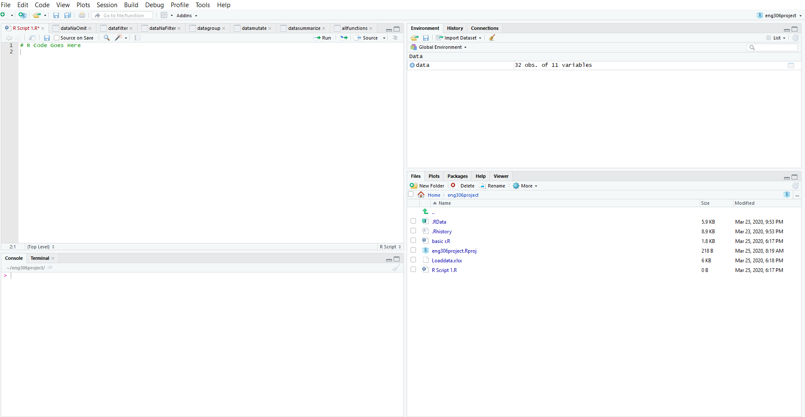
<ul>
<li><strong>The Script Panel </strong>is where R code is written and executed. A new script can be opened by clicking <strong>File</strong>, hovering over <strong>New File</strong>, and then clicking <strong>R Script</strong>. Clicking on <strong>Run</strong> at the right corner of the script panel will run the currently selected line of code.</li>
<li><strong>The Console Panel </strong>displays the output of the code contained in R scripts when they are executed.</li>
<li><strong>The Global Environment Panel</strong> displays all datasets and variables that have been loaded into the project. All objects in the global environment can be accessed by the script panel with code. Datasets in the global environment will display their data in table form when clicked on.</li>
<li><strong>The Files Panel</strong> displays all the files inside the project folder.</li>
</ul>

<strong>Loading Data Into RStudio</strong>

To load data into RStudio, the data must first be stored in a data file. Some common file types used for storing data are Excel files, comma separated value files, and Rdata files. To load one of these files into the global environment, first place a data file into the project folder. It will then appear in the <strong>Files Panel</strong>. Click on the desired data file in the files panel and select <strong>Import Dataset</strong>. This will open the interface for loading data which shows a preview of the data and the code used to load it into RStudio. Make sure the <strong>First Row as Names</strong> box is checked if the first row of the data contains the column names. If the dataset does not contain column names, uncheck the box and RStudio will assign default names to each column that can be changed later. After clicking <strong>Import</strong> the data file will be loaded into the <strong>Global Environment Panel </strong>and be ready for analysis.

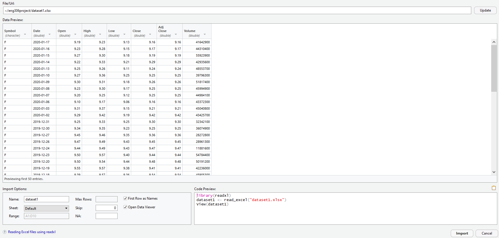

<strong>Packages </strong>

Packages in R are user-made functions that can be downloaded into RStudio and add more features to the base R language [1]. The most essential R package is Tidyverse, which is a compilation of the most useful R packages. The added packages include the Dplyr and Ggplot2 packages, which will be the focus of this guide. The Dplyr package contains a variety of helpful functions for data manipulation and the Ggplot2 contains functions for creating visualizations of datasets. By installing Tidyverse, both of those packages are installed, along with a few extra packages. The following code uses the <strong>install.packages()</strong> function to install the package to an RStudio project.

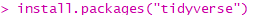

Once installed, the package then needs to be loaded with the <strong>library()</strong> function before the functions of the package can be used. The code below is used to load the installed package into the RStudio project.

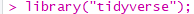

This is the process for installing any R package into RStudio. Just replace &ldquo;tidyverse&rdquo; in the code with the desired package name. The process of installing and loading a package into RStudio will need to be repeated for every new project.

<strong>Example Data Introduction</strong>

For all examples the mtcars dataset will be used. Mtcars is built into to RStudio and often used for teaching because it is a clean and easily accessible dataset that can be accessed without having to load the dataset into the global environment [2]. The dataset has some basic numerical data about cars:

<ul>
<li><strong>mpg</strong> Miles/(US) gallon</li>
<li><strong>cyl</strong> Number of cylinders</li>
<li><strong>disp</strong> Displacement (cu.in.)</li>
<li><strong>hp</strong> Gross horsepower</li>
<li><strong>drat</strong> Rear axle ratio</li>
<li><strong>wt</strong> Weight (1000 lbs)</li>
<li><strong>qsec</strong> 1/4 mile time</li>
<li><strong>vs</strong> Engine (0 = V-shaped, 1 = straight)</li>
<li><strong>am</strong> Transmission (0 = automatic, 1 = manual)</li>
<li><strong>gear</strong> Number of forward gears</li>
<li><strong>carb</strong> Number of carburetors</li>
</ul>
<h1 id="WorkingWith"><strong>Working With Base R</strong></h1>

Base R is R without any extra packages downloaded. All the functions of base R are usable as soon as a new RStudio project is created. Although R packages provide many extra functions, base R has plenty of useful functions for data manipulation and exploration.

<strong>The Assignment Operator</strong>

Rather than using an &ldquo;=&rdquo; operator to assign values to variables like other programming languages, R uses the &ldquo;-&gt;&rdquo; operator for assignment [3]. The &ldquo;-&gt;&rdquo; operator is very flexible because it can assign values in both directions.

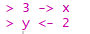

Using the assignment operator, we can make a copy of the mtcars dataset. It is always good to make a copy of a dataset before running any data manipulation code because if the code does not do its intended function and the dataset is drastically changed, the original is available to undo any mistakes.

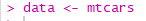

<strong>Exploring Data</strong>

Now that we have a copy of the mtcars dataset named data, we can began looking at it. The <strong>head()</strong> function can be used to view the first 6 rows in the dataset to show what the data looks like [1].

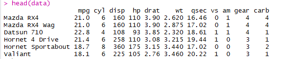

We can then call the structure and summary function on the data. These functions are useful for exploring any dataset because they give you a quick overview of the data. The <strong>str()</strong> function displays how many variables and observations the dataset contains [1], Along with all the column names, the datatypes, and 10 values in each column. The <strong>summary()</strong> function displays the minimum value, the 1st quartile, the median, the mean, the 3rd quartile, and the maximum value [3]. Both of these functions are simple ways to examine any dataset and give an idea of what the data is like.

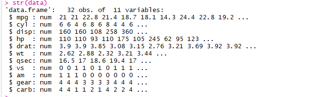
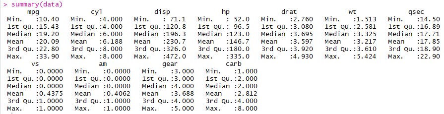

<strong>Dollar Notation</strong>

The dollar notation uses the &ldquo;$&rdquo; sign to quickly select any column of a data frame. The &ldquo;$&rdquo; is used by typing the name of the dataset, a dollar sign, and then the desired column [1]. For example, the code below selects the horsepower column of our previous dataset.

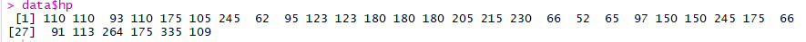

Once a column is selected it can also be used for some basic calculations.

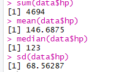

This notation can be used for more than taking quick looks at data and calculations. The dollar notation can add new variables to a dataset when combined with the assignment operator. The code below shows an example of creating a new variable using the variables of the dataset, in this case we can create a variable called, wt_hpRatio by dividing weight by horsepower.

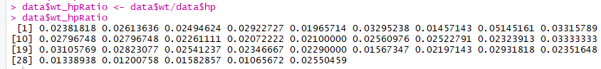

Another area where the dollar notation can be used is fixing datatypes. From the <strong>str()</strong> function call in the previous example we can see that all our variables are stored as numbers. However, the automatic transmission variable only has two possible values, &ldquo;0&rdquo; for automatic and &ldquo;1&rdquo; for manual, which means that it is actually a categorical variable. It is important to correct data types when cleaning data to be sure that R knows the intended datatype when doing calculations because it could cause calculation errors.

The datatype for categorical values is &ldquo;factor&rdquo; in R. This issue can be resolved by using the <strong>as.factor()</strong> function and the dollar notation [3]. The code below uses the dollar notation to select the automatic transmission variable and replace it with the automatic transmission variable converted into a factor.

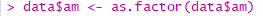

<strong>NA Values </strong>

When analyzing datasets there is often missing data. When data is missing it is displayed as an &ldquo;NA,&rdquo; which means, not available [1]. NA values could make rows of data unusable which causes data in visualizations or models to be less accurate. Luckily, R has several ways of dealing with NA values. To show these methods, the dollar notation is used to add a new column, &ldquo;natest,&rdquo; that contains an NA value. This code will add an NA value to the first row, and numbers 1 through 31 to the remaining rows.

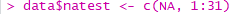

The first option is to use the <strong>complete.cases()</strong> function [3]. This function creates a logical vector that assigns a true value if the row is a complete case and a false value if the row contains an NA. We can call the <strong>complete.cases()</strong> function on our data and assign it to a new variable, dataNoNA. Calling a summary of the newly created variable displays the number of complete cases as true and the incomplete cases as false. This method is useful in getting an idea of how many NA values a dataset may contain.

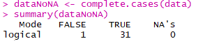

Once the number of NA values in a dataset is discovered, it&rsquo;s time to resolve them. The first option is the <strong>na.omit()</strong> function [3]. This function removes all the rows that contain an NA value.

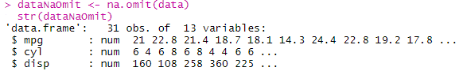

After calling <strong>na.omit()</strong> on the dataset, the <strong>str()</strong> call reveals that there is now 31 observations instead of the original 32 because the <strong>na.omit()</strong> function removed the row containing the NA value. Resolving NA values can also be integrated into Dplyr functions which are covered more in the Dplyr section of this guide. Combining the <strong>complete.cases()</strong> function with the <strong>filter()</strong> function can be an effective way to remove NA values while executing other Dplyr functions.

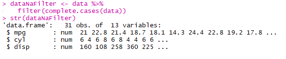

By adding an &ldquo;!&rdquo; before <strong>complete.cases()</strong> the filter will do the opposite, it will create a dataset with only the rows that have NA values. This can be useful because it separates all the clean data from the data with NA values and makes it easier to evaluate the NA values of the incomplete cases without removing all the data. In many situations incomplete cases can still be valuable if only a few columns contain NA values. In this case, <strong>!complete.cases()</strong> returns the 1 observation of the 32 total observations that contains an NA value.

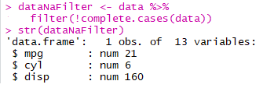

Both the <strong>na.omit()</strong> and the <strong>complete.cases()</strong> functions are very effective in finding and removing NA values. However, <strong>complete.cases()</strong> is easier to implement into Dplyr functions and <strong>na.omit()</strong> is easier to use outside of Dplyr functions.

<h1 id="Dplyr"><strong>The Dplyr Package</strong></h1>

This package creates a structure of code for data cleaning and manipulation that is easy to read and write [4]. It does this by using chains of Dplyr functions or &ldquo;verbs&rdquo; where data is piped into each function after being executed by the function before it. The main functions are as follows:

<ul>
<li><strong>Select</strong> is used to choose or remove specific columns from datasets</li>
<li><strong>Filter</strong> is used to return only rows from a dataset that satisfy chosen conditional statements</li>
<li><strong>Mutate</strong> can be used to create new variables with data contained in the dataset</li>
<li><strong>Group By </strong>groups variables together when calculations are performed</li>
<li><strong>Summarize</strong> aggregates data into one value or one value per group using summary statistics like mean, median, and standard deviation.</li>
<li><strong>Arrange</strong> sorts the rows of a dataset by one or many variables in descending or ascending order.</li>
</ul>

Blocks of Dplyr code can use any number of the main functions to perform data manipulation. When using Dplyr functions, data is moved into each function using a pipe operator, <strong>%&gt;% </strong>[4]. The basic syntax is to first type the name of the new dataset that will contain the result of the Dplyr code, in this case &ldquo;datadplyr&rdquo;. Then use the assignment operator to assign the dataset that will be manipulated to the new dataset name, which is &ldquo;data.&rdquo; Now the pipe operator be placed after the dataset that will be manipulated. On the next line, the first Dplyr function can be placed, in this example the <strong>select()</strong> function is used. After the <strong>select() </strong>function, another pipe operator will be placed to move the data into the <strong>mutate()</strong> function on the next line. After the <strong>mutate()</strong> function, another pipe operator is placed to move the data into the <strong>summarize() </strong>function. After the <strong>summarize() </strong>function, no more Dplyr functions are used for this code block so another pipe operator is not needed and the result of the code will be assigned to the new dataset, &ldquo;datadplyr.&rdquo;

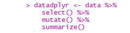

<strong>Dplyr Select()</strong>

The <strong>select()</strong> function is used to select only desired columns [5]. The <strong>select()</strong> function is useful for simplifying datasets to show only the columns that are significant for the analysis being done. Using the <strong>colnames()</strong> function, the columns of the original dataset are shown. The <strong>select()</strong> function can then be used to keep only the weight, cylinder, and miles per gallon columns. This function keeps all the rows of the dataset but only selects the data in the desired columns.

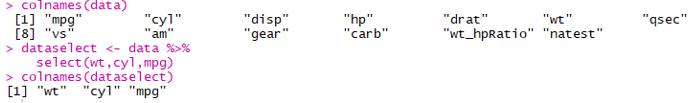

If you only want to remove a few columns from the dataset, select can also be used to deselect from a dataset. Using the &ldquo;-&ldquo; before a column will have the same output as typing all the columns you want to keep individually but in less and more readable code. The code below selects all the columns except weight using the &ldquo;-&ldquo; symbol.

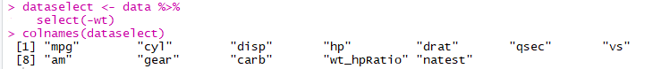

<strong>Dplyr Filter()</strong>

The <strong>filter()</strong> function is used to return only rows that satisfy specific conditions [6]. It uses logical operators to create conditions that can be used to evaluate values contained in the dataset. Here is an example of a <strong>filter()</strong> function that will assign the returned rows into a new dataset that will only contain rows that have a mpg value of less than 20.

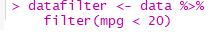

The <strong>or</strong> operator, &ldquo;|&rdquo; and <strong>and</strong> operator, &ldquo;&amp;&rdquo; operators can be used to add more conditional statements to the <strong>filter()</strong> function call.

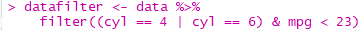

This filter uses multiple conditional statements to only return rows that have 4 or 6 cylinders, and a miles per gallon value of less than 23. There is no limit to how many conditional statements can be placed, so the filtering can be very complex or very simple depending on the need.

<strong>Dplyr Mutate()</strong>

The <strong>mutate()</strong> function is used to create new variables in datasets [7]. Creating new variables is something that has already been covered using the dollar sign notation, but it can also be integrated into Dplyr. While the dollar notation is simpler, mutate can be used in conjunction with other Dplyr functions to make code more readable and remove chances for error because it will be completed with any other Dplyr functions on a dataset. The code below remakes the weight to horsepower variable created earlier but in the syntax for mutate. The name of the new variable is written and is set equal to the equation used to create the new variable.

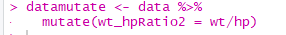

<strong>Dplyr Summarize()</strong>

The <strong>summarize()</strong> function is used to reduce a dataset to one value that summarizes the data [8]. The syntax is very similar to the mutate function; the name of the new variable is typed and set equal to the equation used to create the variable. The code below shows a number of statistical functions like mean and median used to create new variables. The result is only one summarizing value for each variable created. Note, summarize and summarise, will work exactly the same regardless of the spelling.

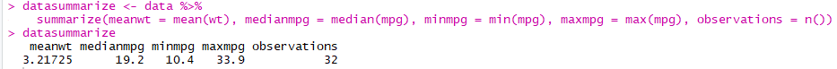

<strong>Dplyr Group_by()</strong>

The <strong>group_by()</strong> function is used to group rows together according to the value. Using the group by function by itself does not change how the data looks, but it does change how it interacts with other Dplyr functions [9]. When combined with the summarize function the group by function will cause the summarize function to calculate its summarizing values for each value in the variable the dataset is grouped by.

For example, if we use the summarize function created in the previous example and group by the cylinder variable, which only has the values 4, 6, and 8, the summarize function will calculate values by group for 4, 6, and 8. This creates 3 rows in the resulting dataset rather than 1 in the previous example.

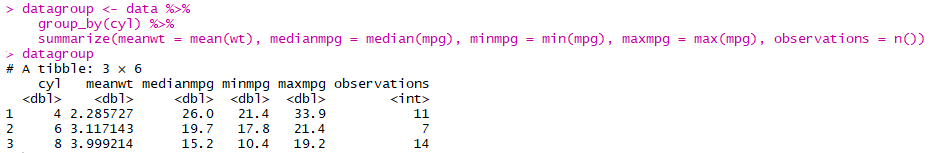

<strong>Dplyr Arrange()</strong>

The <strong>arrange() </strong>function is used to sort datasets by variables in descending or ascending order and is very useful for displaying data [10]. Arrange will sort ascending unless specified, it will also place all NA values of a sorted column at the end of the dataset regardless of being sorted ascending or descending. Arrange can also be used to sort by many variables at once. The code below sorts by cylinders descending and miles per gallon ascending

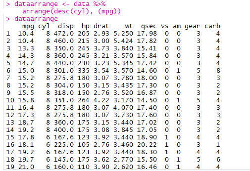

<strong>Putting Dplyr All Together</strong>

The biggest strength of Dplyr is that all the previously described functions can be combined into one block of easy to read and easy to write code. The code below uses the <strong>select()</strong> function to use only a few variables for this block of code. The data is then piped into a <strong>filter()</strong> that selects only rows with a miles per gallon above 10 and more than 1 carburetor. The data is piped again into a <strong>mutate()</strong> which creates a new variable, miles per gallon to horsepower ratio. The data is then piped into a <strong>group_by()</strong> function for number of cylinders to prepare for a <strong>summarize()</strong> function. The data is piped into a <strong>summarize(),</strong> which calculates the mean, minimum, maximum, difference, and the number of observations for each value of cylinders in the dataset. The data is finally piped into an <strong>arrange()</strong> function where it is sorted by the newly created average miles per gallon and horsepower ratio.

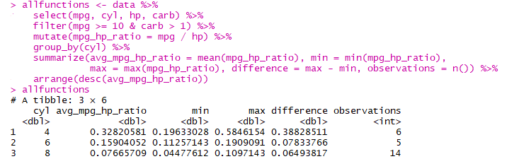

This block of code is an example of how Dplyr can be used to create easy to read code and produce a dataset that explains specific parts of the data. In this case, the data displays the relationship between the number of cylinders and the miles per hour and horsepower ratio.

<h1 id="Ggplot2"><strong>The Ggplot2 Package</strong></h1>

Visualizing data is one of the quickest and easiest ways to clearly explain datasets with many rows of data. Ggplot2 is a package made specifically to create visualizations from datasets. All visualizations made with Ggplot2 start by calling the <strong>ggplot()</strong> function and assigning variables to the x-axis and the y-axis along with a &ldquo;geom layer&rdquo; [11]. Geom layers are used to specify the type of graph created. For example, to create a bar graph you would add <strong>geom_bar()</strong> to your <strong>ggplot()</strong> function and to create a point graph, you would add <strong>geom_point()</strong> to your <strong>ggplot()</strong> function.

A visualization will display over the files panel on the bottom right of RStudio. If more than one visualization is created, the blue arrows can be pressed to view any other graphs. To return to the file panel, click the <strong>Files</strong> tab and to switch back to showing visualizations, click the <strong>Plots</strong> tab.

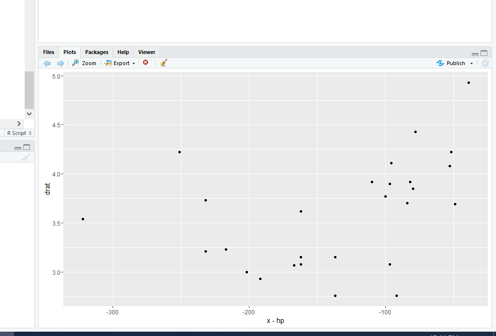

<strong>The Ggplot() Function and Aes() Function </strong>

The <strong>ggplot()</strong> is the first step in creating a visualization. The initial value the function expects is the dataset the visualization will be created from [11]. To set the appearance of the visualization, the <strong>ggplot()</strong> function then expects an aesthetic function call, <strong>aes()</strong>.

The <strong>aes()</strong> function is where the variables assigned to the x-axis and the y-axis are declared [12]. This function is usually written differently based on the type of geom layer used. The code below shows a basic example of a <strong>ggplot()</strong> function set to use cylinders on the x-axis and miles per gallon on the y-axis.

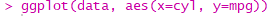

Once the <strong>ggplot()</strong> function and the <strong>aes()</strong> function contained inside it are finished, a geom layer is still needed to display data. Without a geom layer, R has no idea how to display the data it has gathered in a <strong>ggplot()</strong> function.

<strong>Geom_point() and Geom_jitter()</strong>

Using the previous example, we can turn that <strong>ggplot()</strong> function into a point graph by using a &ldquo;+&rdquo; operator to add <strong>geom_point()</strong> to the <strong>ggplot()</strong> function [13].

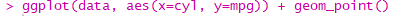

This will result in this fairly boring looking point graph.

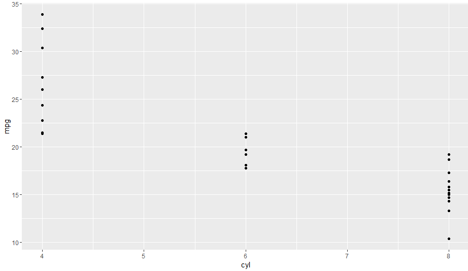

An important part of data analysis is making visualizations that are easy to read and capture the attention of someone. One easy way to achieve that is to add color, which can be done in the <strong>aes()</strong> function where a variable can be assigned to the color value. The color variable can be already represented on the x-axis or y-axis, or the color variable can be assigned to a new variable to make the visualization more informative [12]. For example, in the first visualization color is assigned to the miles per gallon variable to further highlight the differences between the data groups. The second visualization has the automatic transmission variable assigned to color to add more information to the graph.

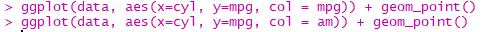
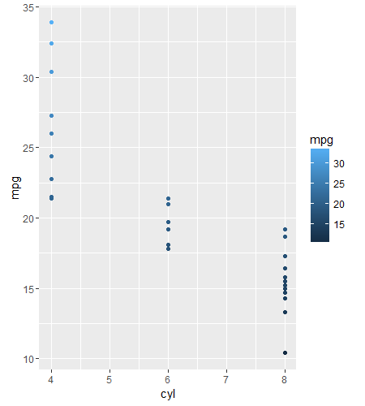
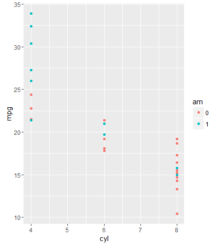

The <strong>aes()</strong> function can also have a value set for <strong>Size</strong>. The variable set to <strong>Size</strong> will make the points bigger based on how large the value of the variable is. In the below code, the variable for <strong>Size </strong>is horsepower, and points with a higher horsepower value will be larger than points with a small horsepower variable.

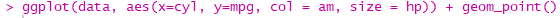
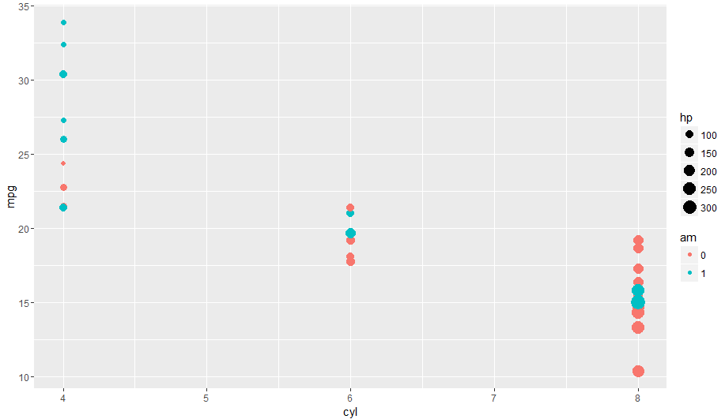

When many points are in similar locations, they can overlap which can make it hard to read data. One way of fixing this is <strong>geom_jitter()</strong>. It works exactly like <strong>geom_point()</strong> but adds slight movement to the datapoints to make them stand out [14].

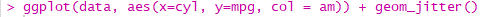
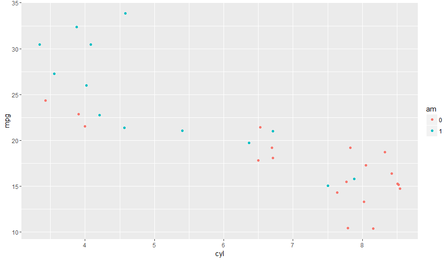

The amount of space between the points can be edited by setting the <strong>width</strong> variable inside of the <strong>geom_jitter()</strong> functions. In the visualizations below, the first visualization contains a width value of 0.5 which keeps the points close together still. The second visualization contains a width value of 1.5 which makes the points more spread out.

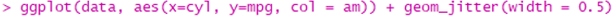
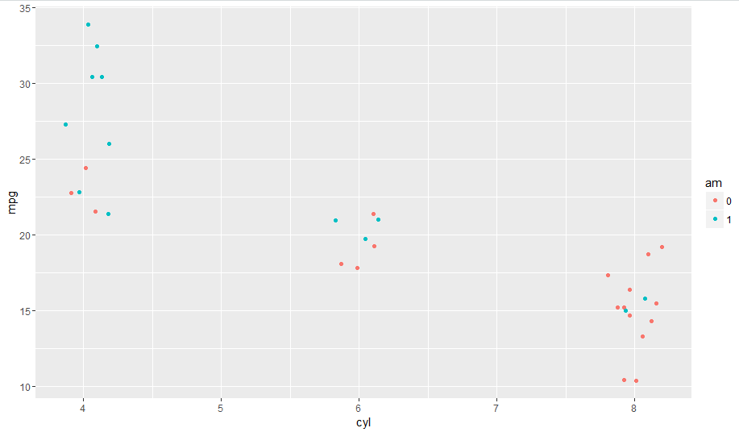
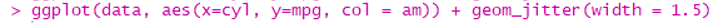
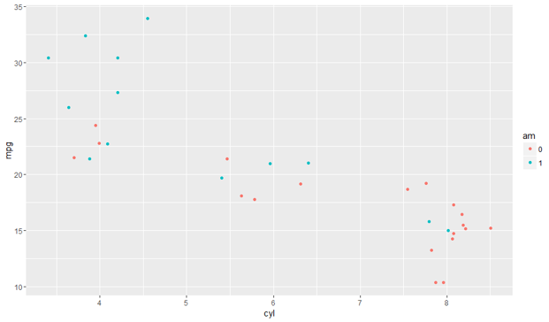

<strong>Geom_col() and Geom_bar()</strong>

The same type of visualization can be made with <strong>geom_col()</strong> but instead of points it will use bars [15]. <strong>Geom_col()</strong> will work best with datasets that have a few summary values rather than showing hundreds of rows. For this example, we will use the &ldquo;allfunctions&rdquo; dataset created at the end of the dplyr tutorial. <strong>Geom_col() </strong>is added to a <strong>ggplot()</strong> function like a <strong>geom_point()</strong> or <strong>geom_jitter()</strong> using the &ldquo;+&rdquo; operator.

This first example will plot cylinders on the x-axis and the variable created with the <strong>summarize()</strong> function, the average miles per gallon to horsepower ratio. For <strong>geom_col()</strong> and <strong>geom_bar()</strong>, <strong>fill </strong>is used in the <strong>aes()</strong> function instead of <strong>col</strong> because you are setting the color of the bar. If <strong>col</strong> is used with a <strong>geom_col()</strong> or <strong>geom_bar()</strong>, it will appear as a barely visible color outline of the bar. In this example the number of observations is assigned to the fill value.

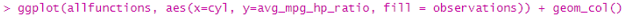
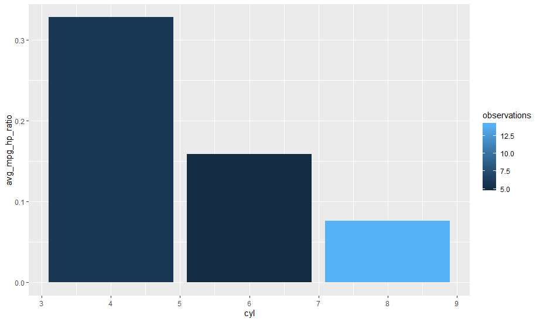

<strong>Geom_col() </strong>and<strong> geom_bar()</strong> can also be displayed horizontally by using the <strong>coord_flip() </strong>function by adding it to the <strong>ggplot()</strong> function using the &ldquo;+&rdquo; operator after <strong>geom_col()</strong> is added. Horizontal displays can be useful if the x-axis has labels with many characters or with a dataset that requires the y-axis to have a long range of values to properly display. The code below demonstrates the same graph created above but appearing horizontally with the <strong>coord_flip() </strong>function applied.

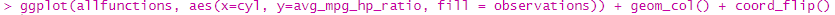
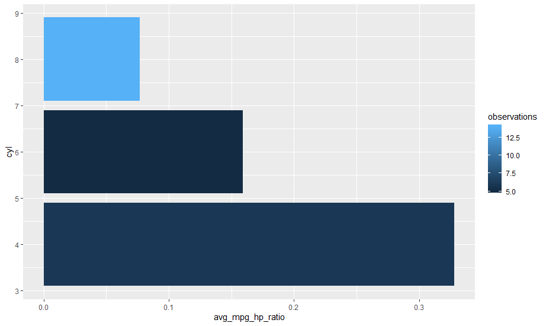

<strong>Geom_bar() </strong>works similarly to <strong>geom_col()</strong> but only with a variable assigned to the x-axis and not the y-axis [15]. This is because <strong>geom_bar</strong> takes the variable assigned to the x-axis and counts the number of observations it has for each value. Using the &ldquo;data&rdquo; dataset, the code below shows the number of rows that have each possible value of the carburetor column and separates them using a fill value of automatic transmission. For example, the visualization below shows that there are 4 rows with 1 carburetor and manual transmission and there are 3 rows with 1 carburetor and automatic transmission.

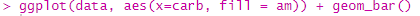
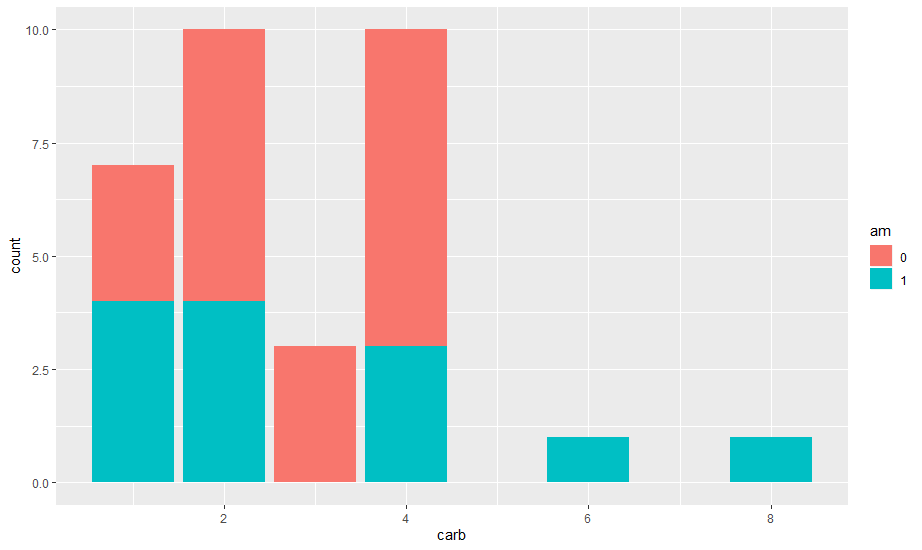

The default setting of <strong>geom_bar()</strong> places the bars on top of each other when separated using <strong>fill</strong> but this is not always the most readable way to present data. To place the bars side by side, change the <strong>position </strong>value inside the <strong>geom_bar()</strong> function to <strong>&ldquo;dodge</strong>&rdquo;. Using this setting makes it easier to read the data.

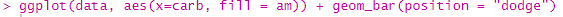

<strong>Geom_histogram()</strong>

The <strong>Geom_histogram() </strong>function also works similar to <strong>geom_bar() </strong>but it places values in bins and displays the number of rows that are contained in each bin [16]. The code below shows horsepower assigned the x-axes and automatic transmission assigned to the <strong>fill</strong> value.

At the moment there is too much empty space between the bars because <strong>geom_histogram()</strong> will set the number of bins to 30 unless specified. In this case, that is creating too many groups for the dataset because there are many empty groups with no data that fit into them, which makes empty spaces. To fix this, we can set the <strong>binwidth</strong> value to 50 to make groups of 50.

This visualization removes most of the empty space and makes it more clear what bin each bar represents but the bars are very close together. The space between bars can be fixed by changing the value of <strong>position</strong> in the <strong>geom_histogram()</strong> to <strong>position_dodge()</strong>. This function works like setting the value of <strong>position</strong> to &ldquo;dodge&rdquo; but it allows you to specify the exact position of the bars. In the code below, <strong>position_dodge() </strong>is used to make the bars overlap which provides space between the bars to improve readability.

<strong>Geom_label() and Geom_text()</strong>

To further increase readability, labels added by <strong>labs() </strong>and<strong> geom_text() </strong>can help. The code below uses the visualization made for the <strong>geom_col() </strong>example. First, a <strong>geom_text()</strong> function is added which labels points or bars with a variable from the dataset [17]. In the <strong>aes()</strong> function created inside of <strong>geom_text()</strong>, the avg_mpg_hp_ratio variable is used as a label and <strong>position_dodge()</strong> is used to place the label in the middle of the bar, and the <strong>vjust</strong> value is used to move the label above the bar.

Next, a <strong>labs()</strong> function is called, and the x-axis, y-axis, and title are given values in quotes that are shown on the visualization [18]. Titles and labels can be essential in making sure the information displayed on the visualization is understood. They can be used to remove any abbreviations or symbols in the variable names that someone not familiar with R might not understand.

<strong>Further Learning</strong>

The best way to learn more about R is to start exploring and working with datasets, and <a href="https://www.kaggle.com/">https://www.kaggle.com/</a> is a great place to start. It is a free website that hosts data analysis competitions and has hundreds of datasets available to download. To learn more about R, free online R textbooks are also available at <a href="https://bookdown.org/">https://bookdown.org/</a> for a number of topics relating to R.

This guide explained only some of the features of Dplyr and Ggplot2. More information can be found about them in their official documentation. The Dplyr documentation can be reached at <a href="https://dplyr.tidyverse.org/reference/index.html">https://dplyr.tidyverse.org/reference/index.html</a> and the Ggplot2 documentation can be reached at <a href="https://ggplot2.tidyverse.org/reference/index.html">https://ggplot2.tidyverse.org/reference/index.html</a> for more explanations and functions.

&nbsp;

&nbsp;

&nbsp;

&nbsp;

&nbsp;

&nbsp;

&nbsp;

&nbsp;

&nbsp;

References

[1] G. Grolemund, <em>Hands-On Programming with R</em>, volume, edition. Sebastopol, CA, USA: O&rsquo;Reilly Media, 2004. [Online]. Available: https://d1b10bmlvqabco.cloudfront.net/attach/ighbo26t3ua52t/igp9099yy4v10/igz7vp4w 5su9/OReilly_HandsOn_Programming_with_R_2014.pdf. Accessed: March 22, 22.

This online textbook will be used to fill in the places where <em>An Introduction to R, 3.6.3</em> does not provide enough detail on in explaining basic R. This source has a strong explanation of the dollar notation and how it can be used to organize datasets.

[2] &ldquo;mtcars.&rdquo; R Documentation. https://www.rdocumentation.org/packages/datasets/versions/3.6.2/topics/mtcars (accessed March 30, 2020).

This documentation explains the source of the mtcars dataset that will be used to create all the example for the project. It also explains the data stored in the dataset and all abbreviations used.

[3] W. N. Venables, D. M. Smith and the R Core Team. <em>An Introduction to R, 3.6.3</em> (2020). Accessed: March 18, 2020. [Online]. Available: https://cran.r-project.org/doc/manuals/r- release/R-intro.pdf

This online manual provides an overview of the syntax for the R programming language. This manual will be used to explain some of the unique features of R that are not in other programming languages. Along with being used to explain how to load packages.

[4] &ldquo;Introduction to dplyr.&rdquo; Comprehensive R Archive Network. https://cran.r-project.org/web/packages/dplyr/vignettes/dplyr.html (accessed March 29, 2020).

This online introduction will be used to fill in the gaps of function descriptions that the Dplyr documentation does not go into detail enough about. It also contains a descriptive overview of Dplyr and why it should be used.

[5] &ldquo;Select/rename variables by name.&rdquo; Dplyr Tidyverse Reference. https://Dplyr.tidyverse.org/reference/select.html (accessed March 18, 2020).

This online documentation comes from the Tidyverse reference webpage, it contains documentation for all the packages that are contained in the Tidyverse. This documentation explains how to use the Dplyr function, select. It explains how the select function can be a very precise tool to show only very specific data from a dataset.

[6] &ldquo;Return rows with matching conditions.&rdquo; Dplyr Tidyverse Reference. https://Dplyr.tidyverse.org/reference/filter.html (accessed March 18, 2020).

This online documentation comes from the Tidyverse reference webpage, it contains documentation for all the packages that are contained in the Tidyverse. This documentation explains how to use the Dplyr function, filter. The documentation provides examples that show the many ways the filter function can be used to return only specific data.

[7] &ldquo;Create or transform variables.&rdquo; Dplyr Tidyverse Reference. https://Dplyr.tidyverse.org/reference/mutate.html (accessed March 18, 2020).

This online documentation comes from the Tidyverse reference webpage, it contains documentation for all the packages that are contained in the Tidyverse. This documentation explains how to use the Dplyr function, mutate. It also provides examples and will be used to show how mutate can be used to create new variables from existing data in datasets.

[8] &ldquo;Reduce multiple values down to a single value.&rdquo; Dplyr Tidyverse Reference. https://Dplyr.tidyverse.org/reference/summarise.html (accessed March 18, 2020).

This online documentation comes from the Tidyverse reference webpage, it contains documentation for all the packages that are contained in the Tidyverse. This documentation explains how to use the Dplyr function, summarize. The documentation shows how the summarize function can be used to quickly take summaries of data using the mean, standard deviation, and quantiles.

[9] &ldquo;Group by one or more variables.&rdquo; Dplyr Tidyverse Reference. https://dplyr.tidyverse.org/reference/group_by.html (accessed March 18, 2020).

This online documentation comes from the Tidyverse reference webpage, it contains documentation for all the packages that are contained in the Tidyverse. This documentation explains how to use the Dplyr function, group by. It also provides examples and will be used to show how group by is used with summarize to provide summarizing measures for many variables instead of one,

[10] &ldquo;Arrange rows by variables.&rdquo; Dplyr Tidyverse Reference. https://Dplyr.tidyverse.org/reference/arrange.html (accessed March 18, 2020).

This online documentation comes from the Tidyverse reference webpage, it contains documentation for all the packages that are contained in the Tidyverse. This documentation explains how to use the Dplyr function, arrange. The arrange function is a simple but very important function for the presentation of data. Its primary role is to sort data by descending or ascending.

&nbsp;[11] &ldquo;Create a new ggplot.&rdquo; Ggplot2 Tidyverse Reference. https://Ggplot2.tidyverse.org/reference/ggplot.html (accessed March 19, 2020).

This online documentation comes from the Tidyverse reference webpage, it contains documentation for all the packages that are contained in the Tidyverse. This documentation explains how to use the main Ggplot2 package function, ggplot. This function is the base for every type of visualization that can be created with Ggplot2 and the documentation provides some basic syntax and examples of it.

[12] &ldquo;Construct aesthetic mappings.&rdquo; Ggplot2 Tidyverse Reference. https://Ggplot2.tidyverse.org/reference/aes.html (accessed March 19, 2020).

This online documentation comes from the Tidyverse reference webpage, it contains documentation for all the packages that are contained in the Tidyverse. This documentation explains how to use the Ggplot2 aesthetic clause. The aesthetic clause is also used in every type of visualization when you assign variables to graph axes. Aesthetic is used differently for each type of visualization making the syntax and examples contained in this documentation very important.

[13] &ldquo;Points.&rdquo; Ggplot2 Tidyverse Reference. https://Ggplot2.tidyverse.org/reference/geom_point.html (accessed March 19, 2020).

This online documentation comes from the Tidyverse reference webpage, it contains documentation for all the packages that are contained in the Tidyverse. This documentation explains how to use the Ggplot2 point layer. The point layer is one of the most essential parts of the Ggplot2 package because it is used to make scatterplots. The documentation provides examples and syntax for using the point layer.

[14] &ldquo;Jittered points.&rdquo; Ggplot2 Tidyverse Reference. https://ggplot2.tidyverse.org/reference/geom_jitter.html (accessed March 20, 2020).

This online documentation comes from the Tidyverse reference webpage, it contains documentation for all the packages that are contained in the Tidyverse. This documentation explains how to use the Ggplot2 jitter layer. It explains the syntax for the jitter layer and how it can be used to make graphs with many data points that are on top of each other more readable.

[15] &ldquo;Bar charts.&rdquo; Ggplot2 Tidyverse Reference. https://Ggplot2.tidyverse.org/reference/geom_bar.html (accessed March 20, 2020).

This online documentation comes from the Tidyverse reference webpage, it contains documentation for all the packages that are contained in the Tidyverse. This documentation explains how to use the Ggplot2 layer for making bar charts and column charts. These two basic types of visualization are important because they are easy to use and informative. The documentation provides syntax and examples of how bar and column charts are created.

[16] &ldquo;Histograms and frequency polygons.&rdquo; Ggplot2 Tidyverse Reference. https://Ggplot2.tidyverse.org/reference/geom_histogram.html (accessed March 20, 2020).

This online documentation comes from the Tidyverse reference webpage, it contains documentation for all the packages that are contained in the Tidyverse. This documentation explains how to use the Ggplot2 histogram layer. This layer can be used to place data into bins and visualize them in a graph. The documentation provides extra syntax and examples on how to create histograms using Ggplot2.

[17] &ldquo;Text.&rdquo; Ggplot2 Tidyverse Reference. https://ggplot2.tidyverse.org/reference/geom_text.html (accessed March 30, 2020).

This online documentation comes from the Tidyverse reference webpage, it contains documentation for all the packages that are contained in the Tidyverse. This documentation explains how to use the Ggplot2 histogram layer. This layer can be used to place data into bins and visualize them in a graph. The documentation provides extra syntax and examples on how to create histograms using Ggplot2.

[18] &ldquo;Modify axis, legend, and plot labels.&rdquo; Ggplot2 Tidyverse Reference. https://ggplot2.tidyverse.org/reference/labs.html (accessed March 30, 2020).

This online documentation comes from the Tidyverse reference webpage, it contains documentation for all the packages that are contained in the Tidyverse. This documentation explains how to use the Ggplot2 histogram layer. This layer can be used to place data into bins and visualize them in a graph. The documentation provides extra syntax and examples on how to create histograms using Ggplot2.

